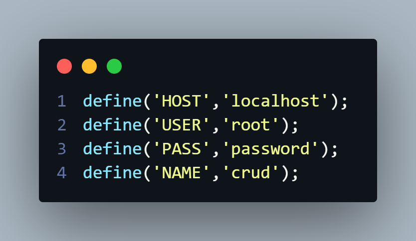

# CRUD PHP com MySQL
Projeto de CRUD de Usuarios utilizando PHP MySQL e Bootstrap, envolve uma tabela simple de Usuario. Contendo apenas, nome, e-mail, data de nascimento e senha.

## Como acessar
Para acessar basta clonar o repositório deste projeto no [GitHub](https://github.com/0CaioG/crud-php-mysql.git), ou através de um convite para a pasta do projeto no Google Drive.

## Banco de Dados
Após clonar o projeto na sua máquina, execute os comandos SQL abaixo para criar a tabela 'users':
```sql
CREATE TABLE `users` (
  `id` int NOT NULL AUTO_INCREMENT,
  `name` varchar(255) NOT NULL,
  `email` varchar(255) NOT NULL,
  `aniversario` date DEFAULT NULL,
  `senha` varchar(255) DEFAULT NULL,
  PRIMARY KEY (`id`)
) ENGINE=InnoDB AUTO_INCREMENT=1 DEFAULT CHARSET=utf8mb4 COLLATE=utf8mb4_0900_ai_ci
```
## Configuração de ambiente
As credenciais de acesso do banco de dados estão na raiz do projeto no arquivo `conexao.php`. Para configurar de acordo, `HOST` vai ser o endereço onde fica o banco, `USER` vai ser o nome de usuario do banco, `PASS` é a senha de acesso do usuario do banco, e `NAME` é o nome do banco que está sendo acessado.

